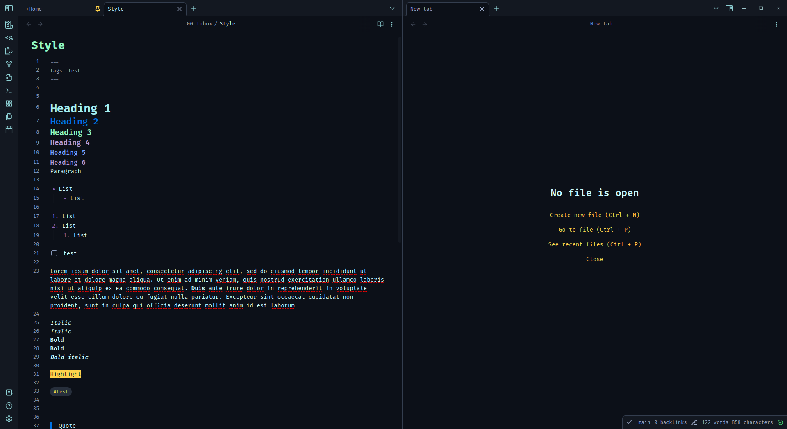

# SILENCE

> Dark theme for [Obsidian](https://obsidian.md/) desktop (v0.16.0) 


Uses [Fira Code](https://fonts.google.com/specimen/Fira+Code).

Please feel free to raise an issue for any bugs or suggestions.

Twitter: [luke-rmaki](https://twitter.com/luke_rmaki)

<br />





---
<br />

## To Do
- [ ] Style tables
- [ ] Style graph


## How to install
### Option 1 (Add from Obsidian)
- This theme is now listed in Obsidian's community themes
- Open Obsidian -> Settings -> Appearance 
- Browser Community themes and search for Rmaki


### Option 2 (Download):

1. Download the `Silence-Obsidian.css` file
2. Copy into your themes folder
3. Open Settings -> Appearances
4. Change Theme to 'Silence-Obsidian'

### Option 3 (Build):

1. Clone the repo
2. Navigate to folder
3. Install deps

```bash
yarn install
```

or

```bash
npm install
```

4. Create a .env file with a single variable called DEST which points to the themes folder in your vault
5. Run build

```bash
yarn build
```

or

```bash
npm run build
```
or

```bash
pnpm run build
```

## Also available for
- [VSCode](https://github.com/luke-rmaki/silence-vscode)
- [Firefox](https://github.com/luke-rmaki/silence-firefox)
